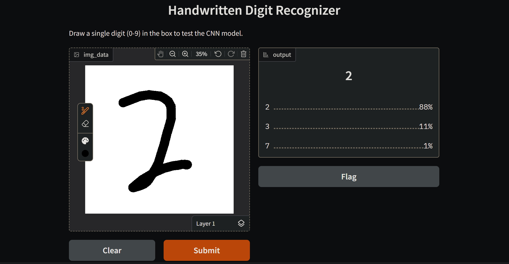

# Handwritten Digit Recognition (CNN)


An end-to-end machine learning project implementing a Convolutional Neural Network (CNN) to recognize and classify handwritten digits. Built with TensorFlow/Keras, the project includes an interactive web UI built with Gradio directly embedded in the Jupyter Notebook for real-time model inference and testing.

## 📸 Interactive Prediction Demo
> *Testing the trained `.keras` model on custom handwriting using the embedded Gradio UI.*

 

## 🧠 Model Details
The model was trained on the MNIST dataset to classify digits (0-9). The preprocessing pipeline handles dynamic image resizing, color inversion (white background to black background), and grayscale normalization to ensure custom user drawings match the model's expected input shape `(1, 28, 28, 1)`.

* **Framework:** TensorFlow / Keras
* **Test Accuracy:** [99.04]
* **UI Framework:** Gradio

**Architecture Highlights:**
* Convolutional Layers (Conv2D) for spatial feature extraction
* MaxPooling2D for dimensionality reduction
* Fully Connected Dense Layers with ReLU activation
* Softmax output layer for multiclass probability distribution

## 📁 Repository Structure
```text
├── handwriting_model.keras          # The saved, compiled CNN model ready for inference
├── Handwritting_Recognition.ipynb   # Data EDA, Model training, and Gradio interface
├── demo_screenshot.png              # Visual proof of the working UI
├── README.md                        # Project documentation
└── requirements.txt                 # Environment dependencies
